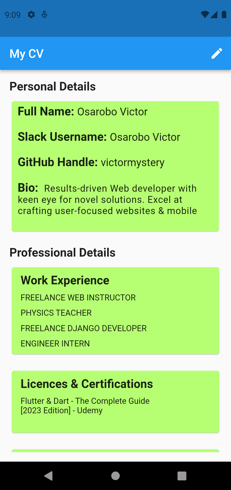
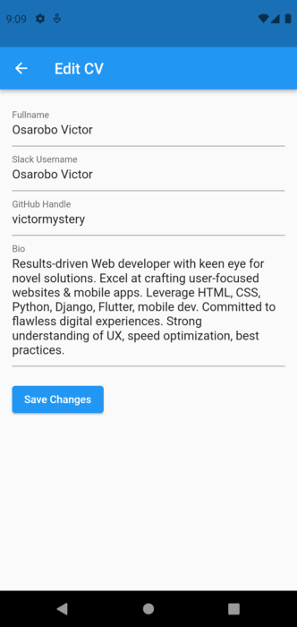

# hngtask_2

This mobile application serves as a comprehensive CV (Curriculum Vitae) for showcasing personal and professional details. It enables users to view and edit CV information. The app is built using the Flutter framework.


## Getting Started

## Table of Contents

- [Setup](#setup)
- [Overview](#overview)
- [Functionalities](#functionalities)
- [Screenshots](#screenshots)
- [Contributing](#contributing)
- [License](#license)

## Setup

Follow these steps to set up and run the Flutter CV application:

1. **Clone the Repository:**

   ```bash
   git clone https://github.com/victormystery/hngtask_2.git
   ```

2. **Navigate to the Project Directory:**

   ```bash
   cd cv_app
   ```

3. **Install Dependencies:**

   ```bash
   flutter pub get
   ```

4. **Run the Application:**

   ```bash
   flutter run
   ```

## Overview

This mobile application provides a clean and organized way to present your CV information. It includes the following details:

- Full Name
- Slack Username
- GitHub Handle
- Brief Personal Bio

The app has two main screens:

1. **Home Page (CV View):**
   - Displays your CV information.
   - Allows you to view your personal and professional details.
   - Provides a button to navigate to the editing page.

2. **Editing Page:**
   - Allows you to edit your CV particulars.
   - Provides user-friendly text fields for modifying the existing CV data.
   - Updates the CV information in real-time without requiring manual refresh.

## Functionalities

- View your CV information.
- Edit your CV details including Full Name, Slack Username, GitHub Handle, and Bio.
- Real-time updates: Changes made in the editing page are immediately reflected on the home page.
- Clean and organized UI for a user-friendly experience.

## Screenshots


*Home Page (CV View)*


*Editing Page*

## Test
[Appetize.io](https://appetize.io/app/ygn4jonphyajueim2n6eq3kyga)

## Contributing

Contributions to improve and expand this Flutter CV application are welcome! If you'd like to contribute, please follow these steps:

1. Fork the repository.
2. Create a new branch for your feature or bug fix.
3. Make your changes and commit them with clear messages.
4. Push your changes to your fork.
5. Create a pull request to the `main` branch of the original repository.


## License

This project is licensed under the MIT License - see the [LICENSE](LICENSE) file for details.


